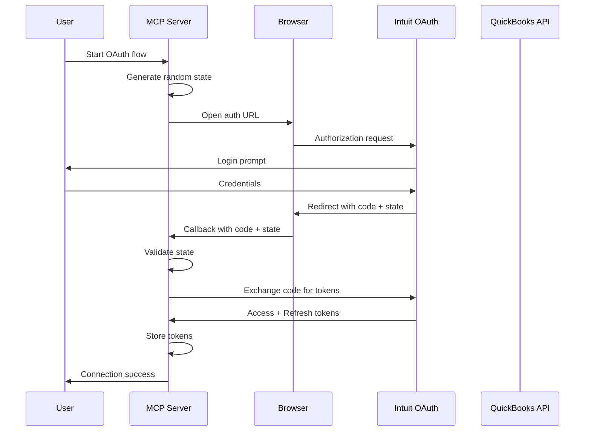
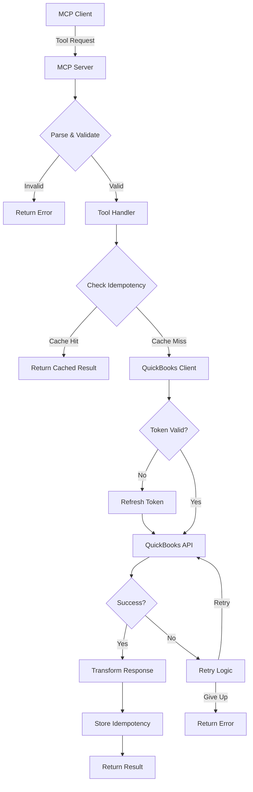
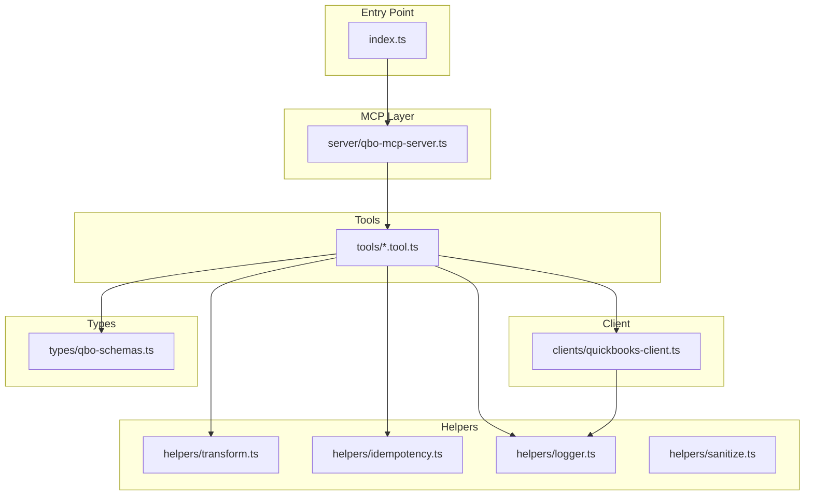

# Architecture Documentation

This document provides an architectural overview of the QuickBooks MCP Server, including key flows, project structure, and entity relationships.

## Table of Contents

- [OAuth 2.0 Authentication Flow](#oauth-20-authentication-flow)
- [MCP Request Flow](#mcp-request-flow)
- [Project Structure](#project-structure)
- [Entity Relationships](#entity-relationships)
- [Key Design Decisions](#key-design-decisions)
- [Extending the Architecture](#extending-the-architecture)

---

## OAuth 2.0 Authentication Flow

The QuickBooks MCP Server uses OAuth 2.0 for secure authentication with the Intuit API. This flow ensures that user credentials are never exposed to the MCP server directly.



### Key Points

- **State Parameter**: A random state is generated to prevent CSRF attacks. The callback validates that the returned state matches the original.
- **Token Storage**: Access and refresh tokens are securely stored for subsequent API calls.
- **Token Refresh**: Access tokens expire after ~1 hour; the refresh token (valid for 100 days) is used to obtain new access tokens automatically.

---

## MCP Request Flow

Every tool request goes through a standardized flow that includes validation, caching, token management, and error handling.



### Key Points

- **Validation**: All incoming requests are validated against Zod schemas before processing.
- **Idempotency**: Write operations support idempotency keys to prevent duplicate transactions.
- **Token Management**: The client automatically refreshes expired tokens before making API calls.
- **Retry Logic**: Transient failures trigger automatic retries with exponential backoff.
- **Response Transformation**: Raw QuickBooks API responses are transformed into consistent, user-friendly formats.

---

## Project Structure

The codebase follows a modular architecture that separates concerns and promotes maintainability.



### Layer Responsibilities

| Layer | Purpose |
|-------|---------|
| **Entry Point** | Bootstraps the server and handles CLI arguments |
| **MCP Layer** | Implements the Model Context Protocol, routes tool calls |
| **Tools** | Individual tool implementations for each QuickBooks operation |
| **Helpers** | Shared utilities for logging, transformation, sanitization, etc. |
| **Client** | HTTP client for QuickBooks API with auth and retry logic |
| **Types** | TypeScript types and Zod schemas for validation |

---

## Entity Relationships

QuickBooks Online entities have well-defined relationships that the MCP server respects and leverages.

```mermaid
erDiagram
    CUSTOMER ||--o{ INVOICE : has
    CUSTOMER ||--o{ ESTIMATE : has
    VENDOR ||--o{ BILL : receives
    VENDOR ||--o{ PURCHASE : receives
    INVOICE ||--|{ LINE_ITEM : contains
    BILL ||--|{ LINE_ITEM : contains
    PURCHASE ||--|{ LINE_ITEM : contains
    LINE_ITEM }o--|| ITEM : references
    LINE_ITEM }o--|| ACCOUNT : references
    ACCOUNT ||--o{ JOURNAL_ENTRY_LINE : debits/credits
    JOURNAL_ENTRY ||--|{ JOURNAL_ENTRY_LINE : contains
    BILL_PAYMENT }o--|| VENDOR : pays
    BILL_PAYMENT }o--o{ BILL : pays
```

### Entity Descriptions

| Entity | Description |
|--------|-------------|
| **Customer** | People or companies you sell to |
| **Vendor** | People or companies you buy from |
| **Invoice** | Sales transactions with payment terms |
| **Estimate** | Quotes or proposals for customers |
| **Bill** | Payables owed to vendors |
| **Purchase** | Direct expenses (checks, credit cards, cash) |
| **Item** | Products or services you sell |
| **Account** | Chart of accounts entries |
| **Journal Entry** | Manual accounting adjustments |
| **Bill Payment** | Payments made to vendors |

---

## Key Design Decisions

### 1. Handler-Based Architecture

Each QuickBooks operation has its own handler file, promoting:
- **Single Responsibility**: Each handler does one thing well
- **Testability**: Handlers can be unit tested in isolation
- **Discoverability**: Easy to find and modify specific operations

### 2. Centralized QuickBooks Client

All API calls go through a single `QuickBooksClient` class that handles:
- Authentication and token refresh
- Rate limiting and retry logic
- Request/response logging
- Error normalization

### 3. Schema-First Validation

Using Zod schemas for all inputs ensures:
- Type safety at runtime
- Helpful error messages for invalid inputs
- Self-documenting API contracts

### 4. Idempotency Support

Write operations support idempotency keys to:
- Prevent duplicate transactions from retries
- Enable safe request replays
- Support exactly-once semantics

### 5. Structured Logging

All operations are logged with structured data for:
- Debugging and troubleshooting
- Audit trails
- Performance monitoring

---

## Extending the Architecture

### Adding a New Entity

1. **Create the handler** in `src/handlers/`:
   ```
   create-quickbooks-{entity}.handler.ts
   get-quickbooks-{entity}.handler.ts
   search-quickbooks-{entity}s.handler.ts
   delete-quickbooks-{entity}.handler.ts (if applicable)
   ```

2. **Add types** in `src/types/` for the entity schema

3. **Register handlers** in the MCP server

4. **Add tests** in `src/tests/`

### Adding a New Helper

1. Create the helper in `src/helpers/`
2. Export from `src/helpers/index.ts` (if applicable)
3. Import and use in handlers as needed

### Modifying the Client

The `QuickBooksClient` is designed to be extended:
- Add new API methods for new endpoints
- Override `makeRequest` for custom behavior
- Add middleware for cross-cutting concerns

---

## Related Documentation

- [Getting Started](getting-started.md) - Initial setup and configuration
- [Authentication](authentication.md) - OAuth flow details
- [API Reference](api-reference.md) - Complete tool documentation
- [Development](development.md) - Contributing guidelines
- [Troubleshooting](troubleshooting.md) - Common issues and solutions
